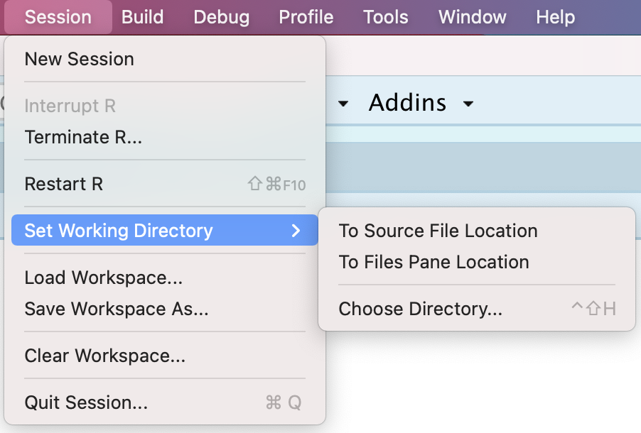
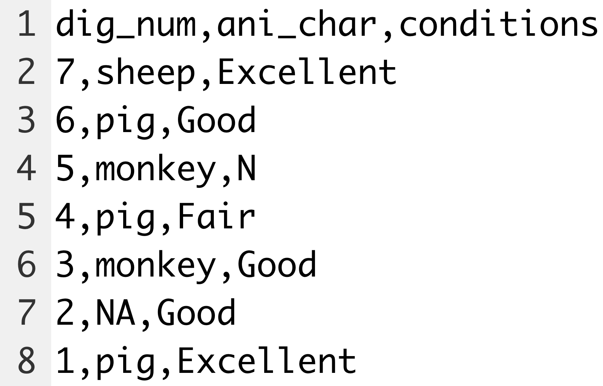

## Exporting Data to Delimited Files  {#export-data}

We will start by introducing how to export data to a file in this chapter.


### Set the working directory {#setwd}

First, we will introduce an important concept called **Working Directory**. To do **data export** and **import**, you are recommended to set the *working directory* since we usually use a path relative to the working directory for interacting with files on the computer in R. To set the working directory, you can click *Session* on the menu and click  *Set Working Directory*. 

```{r setwd1, results = TRUE, echo=FALSE, fig.align = 'center', fig.cap="Set Working Directory", out.width = '90%'}

```


There are three options under this menu. 

- *To Source File Location*: this is the same directory as the current R script. 
- *To Files Pane Location*: this is the same directory as shown in the Files Panel on the bottom right of RStudio. 
- *Choose Directory...*: this will open up a window from which you can choose any desired directory. 

After selecting any of the three options, we can see a line of code containing the function `setwd()` executed in the console. 
```{r setwd2, results = TRUE, echo=FALSE, fig.align = 'center', fig.cap="Set Working Directory (2)", out.width = '90%'}

```


Indeed, this menu operation is equivalent to using the `setwd()` function with the argument being the full path or relative path of the desired directory. 


Another related function is `getwd()` which tells us the absolute path representing the current working directory.
```{r, eval=FALSE}
getwd()
```


### Delimited files

In most applications, you will use a specific file type called **delimited** file. In a delimited file, each row represents a single observation, and it has values separated by the **delimiter**. In principle, *any character (including letters, numbers, or symbols)* can be used as a delimiter, with the most commonly used ones being the following.

```{r echo = FALSE, results = TRUE}
library(tibble)
Delimiter  <- c("comma","space","tab")
Symbol <- c("`,`", "` `", "`\\t`")
File_Extension <- c(".csv", ".txt",".tsv")

d <- tibble(Delimiter, Symbol, `Common File Extension` = File_Extension )
knitr::kable(d)
```


### Write an object into a .csv file {#write-csv}

First, let's work with one popular kind of *delimited* files called  *comma-separated value* file, usually with the file extension .csv. In a .csv file, the *delimiter* is *comma* (`,`) . 

Let's first create a data frame.

```{r, eval=TRUE}
dig_num <- 7:1
ani_char <- c("sheep", "pig", "monkey", "pig", "monkey", NA, "pig")
conditions <- c("Excellent", "Good", "N", "Fair", "Good", "Good", "Excellent")
my_animals<- data.frame(dig_num, ani_char, conditions)
my_animals
```

Now, let's write the data frame `my_animals` into a file called "my_animals.csv" in the currently working directory. To write an object into a .csv file, you can use the `write_csv()` function in the **readr** package. Since **readr** is a sub-package of **tidyverse**, you can load the package directly if the **tidyverse** package is installed.

```{r, eval=FALSE}
library(readr)
write_csv(my_animals, "my_animals.csv")
```

You can verify the .csv file has been indeed created and open the file with RStudio or any text editor to verify its contents. 

```{r csv, results = TRUE, echo=FALSE, fig.align = 'center', fig.cap="File Contents", out.width = '90%'}

```


We can see that all the information has been written in the .csv file, which has *commas* separating the values on each line. In particular, you may find out the first row of the file corresponds to the column names. If you don't want to include the column names, you can set the argument `col_names = FALSE`. 

```{r, eval=FALSE}
write_csv(my_animals, "my_animals_no_colname.csv", col_names = FALSE)
```

By default, `write_csv()` writes the data into a file in which `NA` is used to represent all the missing values, just like in the tibble. If you want to use another string to represent the missing values in the file, you can set the argument `na` to be the string. 

```{r, eval=FALSE}
write_csv(my_animals, "my_animals_missing.csv", na = "This value is missing!")
```


### Write an object into a general delimited file {#write-delim}

As introduced at the beginning, there are different types of *delimited files* depending on the specific *delimiter*. The function `write_delim()` enables us to write an object into a delimited file with any chosen delimiter. The usage of `write_delim()` is almost identical to `write_csv()`, except that it has an additional argument `delim`, which specifies the delimiter to be used. Let's see the following example with `*` as the delimiter. 

```{r, eval=FALSE}
write_delim(my_animals, "my_animals_star.csv", delim = "*")
```

### Exercises

Use R to create the following data frame and assign it to the name `my_data`.

```{r, echo=FALSE, results=TRUE}
cha <- c("one", "two", NA, "four", "five")
num <- c(1, NA, 3, 4, 5)
let <- letters[1:5]
my_data <- data.frame(word = cha, number = num, letter = let)
my_data
```


1. Write R code to set working directory to desktop and write `my_data` into a .csv file named "my_data_no_name.csv" without column names. 


2. Write R code to write `my_data` into a delimited file called "my_data_na.csv" with `#` as the delimiter and use `999` as the indicator for missing values. 

